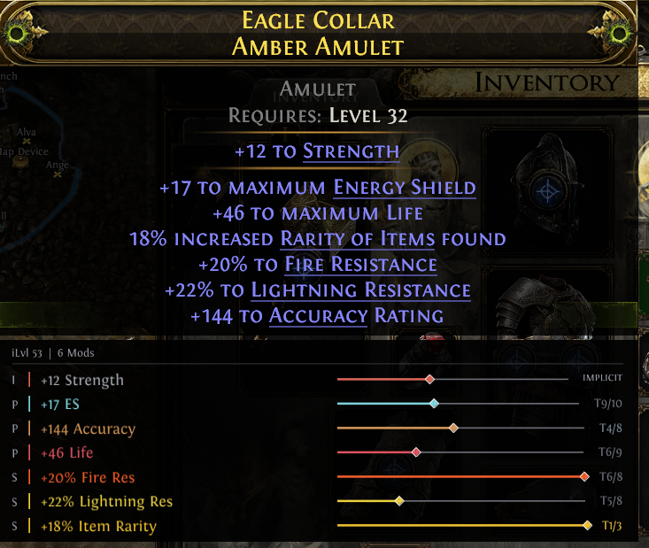
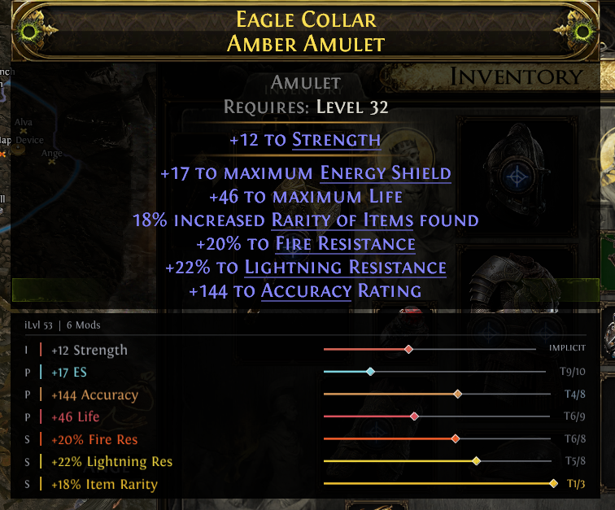

# LootLens2

item analyzer/visualizer for poe2

## Roll slider modes

### Current Tier

The diamond shows where the roll landed **inside its current modifier tier**. This is useful when you want to know whether that specific tier rolled low or high.

### All Possible Tiers

The diamond compares the same roll against the **full range of tiers available to that item base**. This gives a better picture of how strong the modifier is overall.

For example, `T9/10` means the item rolled Tier 9 and there are 10 valid tiers for that modifier on the base.

The built in leveling filter is still being worked on but works for a few mods now. 

